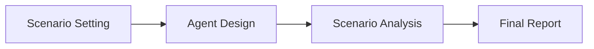

# Scenario Swarm

<p align="center">
  <b>A Streamlit app for building stakeholder agents, running multi-round scenario debates, and generating structured final reports.</b>
</p>

<p align="center">
  
  
  
  
</p>

---

## Overview

**Scenario Swarm** is a multi-agent business simulation app built with Streamlit and the OpenAI API.

The app lets users define a scenario, create stakeholder agents with different positions and reasoning styles, run an automatic debate between those agents, and generate a final report that summarizes the discussion.

The app is useful for exploring situations where multiple stakeholders have different incentives, assumptions, concerns, and priorities.

---

## What the App Does

Scenario Swarm helps users move from a scenario idea to a structured debate output.

Users can:

- choose a preset scenario or create a custom scenario,
- define stakeholder agents,
- assign each agent a position and reasoning style,
- optionally add supporting article URLs for each agent,
- run a debate for 1 to 4 rounds,
- view live agent responses as they are generated,
- generate a final moderator-style report,
- and download the full output as a Markdown export.

---

## Core Features

| Feature | Description |
|---|---|
| **Scenario setup** | Choose a preset scenario or create a custom scenario with a title, category, and core theme. |
| **Stakeholder agents** | Create 2 to 3 agents with unique names and positions. |
| **Reasoning styles** | Select from Balanced, Analytical, Skeptical, Empathetic, Practical, and Contrarian reasoning styles. |
| **Temperature control** | Adjust each agent's response style from focused to creative. |
| **Supporting URLs** | Add up to 3 article URLs per agent and extract readable context from them. |
| **Automatic debate** | Run a structured debate where agents respond to the scenario and to each other. |
| **Live streaming output** | Watch each agent's response appear in real time. |
| **Debate rules** | Apply shared rules such as avoiding repetition, challenging assumptions, and responding to prior points. |
| **Final report** | Generate a structured report with scenario summary, agent summaries, argument map, unresolved questions, and closing note. |
| **Markdown export** | Download the scenario, agent configuration, debate transcript, and final report. |

---

## App Workflow

The app follows a four-step flow:



---

## Steps Involved

### 1. Scenario Setting

In this step, the user defines the situation that will be debated.

The user can either:

- select a preset scenario, or
- create a custom scenario.

A scenario contains:

| Field | Meaning |
|---|---|
| **Scenario Title** | The name of the situation being explored. |
| **Broad Business Category** | The domain or area of the scenario. |
| **Core Theme** | The main question or tension that agents will debate. |

After saving the scenario, the app unlocks the agent design step.

---

### 2. Agent Design

In this step, the user creates stakeholder agents.

Each agent requires:

| Field | Meaning |
|---|---|
| **Agent Name** | The stakeholder identity or role. |
| **Position / Focusing Point** | What the agent believes, supports, questions, or argues against. |
| **Temperature** | Controls how focused or creative the agent's responses are. |
| **Reasoning Style** | Defines how the agent reasons during the debate. |
| **Supporting Article URLs** | Optional sources that provide extra context for that agent. |

The app requires at least **2 complete agents** and supports a maximum of **3 agents**.

Available reasoning styles:

| Reasoning Style | Behavior |
|---|---|
| **Balanced** | Weighs both sides and acknowledges tradeoffs. |
| **Analytical** | Uses structured logic, tradeoffs, and evidence-oriented reasoning. |
| **Skeptical** | Questions assumptions, exposes risks, and pushes for proof. |
| **Empathetic** | Focuses on people, trust, adoption, emotions, and lived experience. |
| **Practical** | Focuses on feasibility, implementation, operations, and constraints. |
| **Contrarian** | Challenges the dominant view and introduces an opposing frame. |

---

### 3. Scenario Analysis

In this step, the user selects which agents will participate and chooses the number of debate rounds.

The debate can run for **1 to 4 rounds**.

Round behavior:

| Round | Purpose |
|---|---|
| **Round 1** | Agents present opening positions. |
| **Rounds 2-4** | Agents defend their position, critique others, and respond to previous arguments. |

During the debate:

- the active agent is shown as writing,
- completed agents are marked as present,
- waiting agents are shown separately,
- responses stream live into the interface,
- and the transcript is saved in app state.

The app also applies shared debate rules so agents avoid repeating themselves and engage with prior arguments.

---

### 4. Final Report

In this step, the app generates a final report based on the full debate transcript.

The final report includes:

| Section | Description |
|---|---|
| **Scenario** | A short summary of what was debated. |
| **Agent Summaries** | A summary of each participating agent's core argument and important points. |
| **Argument Map** | A table of major tensions between agents. |
| **Strongest Unresolved Questions** | Key questions that remain open after the debate. |
| **Moderator Closing Note** | A closing synthesis without declaring a final winner. |

The user can also download the full export as a Markdown file.

---

## Tech Stack

| Layer | Tool |
|---|---|
| App framework | Streamlit |
| Language | Python |
| LLM provider | OpenAI |
| Default model | `gpt-4o-mini` |
| Web extraction | Requests, BeautifulSoup, optional Trafilatura |
| Output export | Markdown |

---

## Installation

### 1. Clone the repository

```bash
git clone https://github.com/your-username/scenario-swarm.git
cd scenario-swarm
```

### 2. Create a virtual environment

```bash
python -m venv .venv
```

Activate it:

```bash
# macOS / Linux
source .venv/bin/activate

# Windows
.venv\Scripts\activate
```

### 3. Install dependencies

```bash
pip install streamlit openai requests beautifulsoup4 trafilatura
```

`trafilatura` is optional. It improves article extraction, but the app can also use BeautifulSoup as a fallback.

---

## OpenAI API Key Setup

The app looks for the OpenAI API key in either Streamlit secrets or a local `API.txt` file.

### Option A: Streamlit secrets

Create this file:

```text
.streamlit/secrets.toml
```

Add:

```toml
OPENAI_API_KEY = "your_api_key_here"
```

### Option B: Local API.txt

Create a file named `API.txt` in the same folder as the app:

```text
OPENAI_API_KEY=your_api_key_here
```

Do not commit `.streamlit/secrets.toml` or `API.txt` to GitHub.

---

## Running the App

If the app file is named `app.py`:

```bash
streamlit run app.py
```

If using the uploaded file name directly:

```bash
streamlit run "app(4).py"
```

Then open the local Streamlit URL shown in the terminal.

---

## Recommended Repository Structure

```text
scenario-swarm/
├── app.py
├── README.md
├── requirements.txt
├── .gitignore
└── .streamlit/
    └── secrets.toml.example
```

---

## Example requirements.txt

```text
streamlit
openai
requests
beautifulsoup4
trafilatura
```

---

## Notes

- The app requires an OpenAI API key to generate debates and final reports.
- Supporting article extraction depends on whether the target website allows readable text extraction.
- The debate output is generated by AI and should be reviewed before use in any formal setting.
- API keys and local secret files should never be committed to a public repository.

---

## License

This project is licensed under the MIT License.
